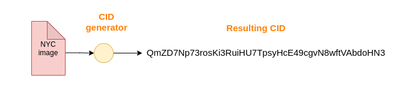
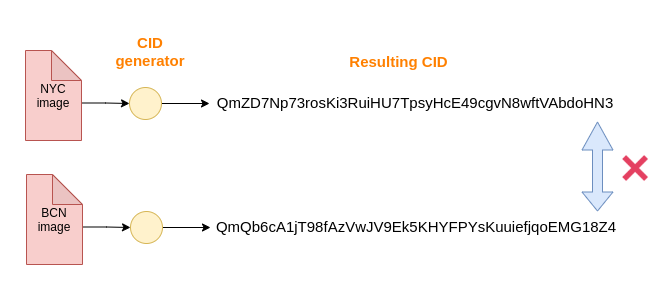
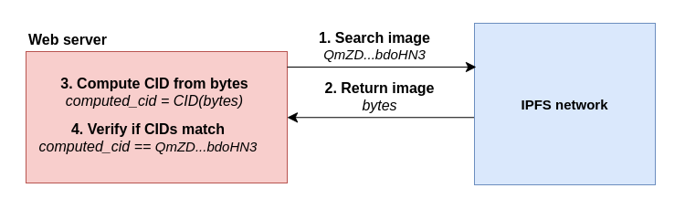
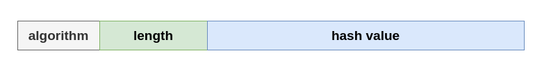
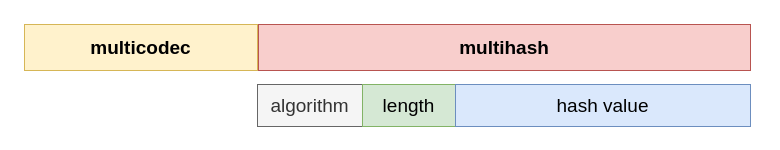
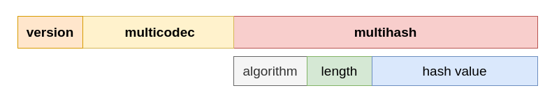
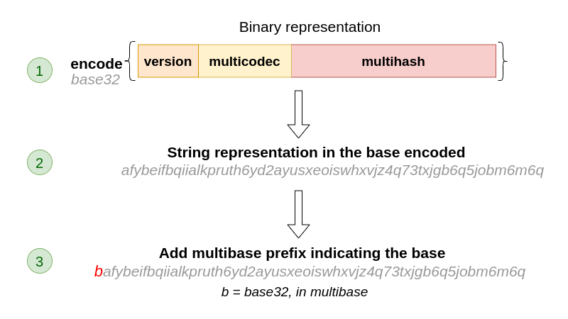

# Part 2 (Comprehensive Lesson): An overview of content addressing in IPFS

## An introduction to content addressing

In today's Internet, we retrieve files by knowing where they are located. Using URLs, we request content at a specific location. 

For example, consider that we want to include a NYC image (located at `https://cityimages.com/nyc.png`) in our website. We are asking the `cityimages.com` host to provide us with a `nyc.png` file, which we expect to be an image of NYC. Consider now that, after a few days, someone changes the `nyc.png` to be an image of Barcelona. Our website, which expected an image of NYC, is now serving an image of BCN instead.

IPFS retrieves files based on their content, instead of their location. This is called content addressing. Every file in IPFS is identified by a CID (Content Identifier), which is a hash (plus some metadata) generated from the content of the file.

Content addressing brings a huge advantage: if the content of the file changes, then its CID will change too. With this approach, we can verify if the content that we receive is really the content that we requested. For example, the CID of the NYC image is not the same as the CID of the BCN image.

The following diagram illustrates the steps involved in the verification of IPFS files. Consider that the NYC image has the `QmZD7Np73rosKi3RuiHU7TpsyHcE49cgvN8wftVAbdoHN3` CID, which was generated from the bytes of the image.

1. By using the CID, we request the image to the IPFS network.
2. Some peer from the network returns the file (i.e. the bytes are transferred).
3. We compute a CID using the bytes returned from the network (consider that the computed CID is stored in a variable called `computed_cid`).
4. If the content received is correct, then the `computed_cid` variable should be equal to the original CID. Therefore, `computed_cid == QmZD7Np73rosKi3RuiHU7TpsyHcE49cgvN8wftVAbdoHN3`.

## Understanding the internals of a CID

We mentioned before that a CID is, essentially, a hash generated from the content of a file, plus some metadata.
IPFS supports two different versions of CIDs (`CIDv0` and `CIDv1`), which include different types of metadata.

### Introducing the CIDv0 format

There are a lot of hashing algorithms available (`sha2-256`, `sha3-256`, `md5`...), and some of them have been proven insecure over time. When the first version of the CID (`CIDv0`, usually called version 0) was designed, the need of supporting several hashing functions was considered. The solution was [multihash](https://github.com/multiformats/multihash), a self-describing hash that contains metadata regarding both the length and the algorithm used to generate the hash.

* `algorithm`: the algorithm identifier used to generate the hash in [multicodec](https://github.com/multiformats/multicodec/blob/master/table.csv) format.
For the `sha2-256` algorithm, the multicodec identifier is `0x12` (hexadecimal).
* `length`: the length of the hash.
For the `sha2-256` algorithm, 256 bits.
* `hash value`: the value of the hash.

The hash allows us to have an identifier of the file based on its contents. However, once we retrieve the actual bytes of the file, how do we decode them? In the `CIDv0` format, the bytes are always read as `dag-pb` (MerkleDAG protobuf). On the other hand, the `CIDv1` format allows us to specify the encoding of the bytes of the file.

The explanation about Merkle DAGs is out of the scope of this lecture, however, you can extend your knowledge on the topic [here](https://proto.school/merkle-dags).

### Introducing the CIDv1 format

While the first iteration of the CID solved the issue of supporting several hashing algorithms, the second iteration, `CIDv1`, solves the issue of supporting several encodings for the data of the file.
The `CIDv1` format adds a prefix that indicates the encoding by using a [multicodec](https://github.com/multiformats/multicodec/blob/master/table.csv) identifier.

Note that the `multicodec` prefix is not the same as the `algorithm` field of the multihash. Although both are specified in the multicodec format, they are not related at all.

Because there are two different versions of the CID, it is also necessary to add another prefix that indicates whether the CID is `CIDv1` or `CIDv0`.

### From binary to string

If we combine all the fields, we get a binary representation (`0`s and `1`s) composed of:

`<CID version><multicodec><multihash>`

However, in the example from the previous section, we provided a string representation (`QmZD7Np73rosKi3RuiHU7TpsyHcE49cgvN8wftVAbdoHN3`). Because the binary representation of a CID is not human-friendly, a human-readable encoding is applied to it (Base32, Base58, Base64...).

In `CIDv1`, we indicate the base encoding of the CID by using a new prefix called `multibase`, which expects a value from the [multibase](https://github.com/multiformats/multibase/blob/master/multibase.csv) protocol.
The multibase prefix is **only** used in the string representation.

`<multibase>encode(<CID version><multicodec><multihash>)`

The following diagram illustrates this behavior.

1. We apply the encoding function to the binary representation. In the diagram, `base32` is used.
2. The encoding function results in a string.
3. We add the corresponding multibase prefix to the string.

Indicating the encoding type as a prefix of the CID allows us to decode it easily.

In `CIDv0`, the base encoding is always `base58btc`, so the multibase prefix is always `Qm`.

### References

* [ResNetLab: Core Course Module - Content Addressing](https://www.youtube.com/watch?v=dN9EvujJ9cM)
* [IPFS official documentation - Content Addressing](https://docs.ipfs.io/concepts/content-addressing/)
* [ProtoSchool - Anatomy of a CID](https://proto.school/anatomy-of-a-cid)

## Quiz

1) Which of the following sentences are correct? (Choose two)
* `CIDv0` allows you to indicate the hash function and the encoding of the data of a file.
* (Solution) `CIDv1` allows you to indicate the hash function and the encoding of the data of a file.
* (Solution) The prefix of a Version 0 CID is always `Qm` in the string representation.
* `CIDv0` allows you to specify the encoding of the binary representation of the CID by using a `multibase` prefix.

2) Which of the following sentences about the `multicodec` field are correct? (Choose two)

* (Solution) The `multicodec` field indicates the encoding used to encode/decode the data of the file.
* The `multicodec` field indicates the hash algorithm used.
* (Solution) The `algorithm` field of the multihash and the `multicodec` field of the CID are specified as multicodec identifiers.
* You must specify the length of the `multicodec` field.

## Activity

_NOT IMPLEMENTED:_ A good activity for this lecture would be analyzing a CID through the CID inspector.

# Part 3: Questions

### Where is data stored on IPFS? How is it accessed?

Data is stored in the peer nodes that are connected to the network. Data is retrieved by content rather than by location. Every file (and its chunks) are identified by a CID (Content Identifier), which is generated from the data itself.

### What happens when content is ‘added’ to IPFS? Where is the data, and what roles do peers and data structures play?

The content is chunked into smaller blocks that are stored in an optimized data structure called Merkle DAG. In order to work with DAGs, the UnixFS protocol is used. UnixFS allows you to convert from and to DAGs, adding metadata to every block. 

### What are some of the technical ways (such as Content Addressing) that Web3 is different from Web2, and where do you predict people will have trouble and misconceptions?

One of the main differences is that Web3 relies on a decentralized network, and people often have difficulties understanding how a decentralized network works. We are not used to thinking _decentralized_.

At the same time, many applications in the Web3 ecosystem use the blockchain technology. Therefore, people coming from Web2 must understand both how a decentralized network works, and the internals of blockchain.

Understanding content addressing might be difficult for some people, but I think it is easier than thinking _decentralized_ (chunking files, distributing chunks, distributed hash table...).
